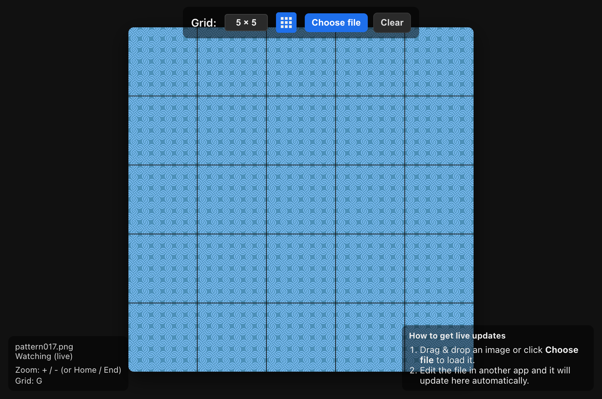

# LiveTile - Seamless Background Visualizer

A simple, client-side tool for visualizing seamless tiles in real-time.

## Features

*   **Cross-Platform & Mobile Friendly:** Works in all modern browsers, including Safari and mobile browsers.
*   **Panning & Zooming:** Pan the view by dragging with your mouse or finger. Zoom with the mouse wheel or by pinching on a touch device.
*   **Live Reload:** In supported browsers (Chrome, Edge), the image automatically updates when you save the source file.
*   **Standard File Loading:** On browsers without live reload support (like Safari and mobile), you can still load images using the "Choose file" button.
*   **Adjustable Grid Size:** Change the grid dimensions to see how your tile repeats.
*   **Adaptive Grid Overlay:** Toggle a grid overlay that automatically adjusts its color for visibility against your image.
*   **View Controls:** Easily reset the pan and zoom or clear the image entirely.

## How to Use

1.  **Open the page:**
    *   https://shirleyman.github.io/live-tile/

2.  **Load an image:**
    *   Drag and drop your image file onto the stage.
    *   Or, click the "Choose file" button to select an image.
    *   *(Note: Live reload is only active when using "Choose file" on supported browsers like Chrome or Edge).*

3.  **Navigate & Adjust:**
    *   **Pan:** Click and drag with your mouse, or drag with one finger on a touch screen.
    *   **Zoom / Change Grid Size:**
        *   Use the mouse wheel.
        *   Pinch with two fingers on a touch screen.
        *   Use the dropdown menu in the top bar.
        *   Use the `+`, `-`, `Home`, and `End` keys on a keyboard.

4.  **Toggle the grid overlay:**
    *   Click the grid icon in the top bar or press the `G` key.

5.  **Reset the view:**
    *   Click the reset icon in the top bar or press the `R` key.

6.  **Live edit (Supported Browsers Only):**
    *   After loading a file via "Choose file" in Chrome or Edge, open the same file in your favorite editor (e.g., Photoshop, Aseprite).
    *   Make your changes and save the file.
    *   The image in Live Tile will update automatically.

## Development

This project is a single, self-contained `index.html` file. There are no external dependencies or build steps.

## License

This project is licensed under the MIT License. See the [LICENSE](LICENSE) file for details.
